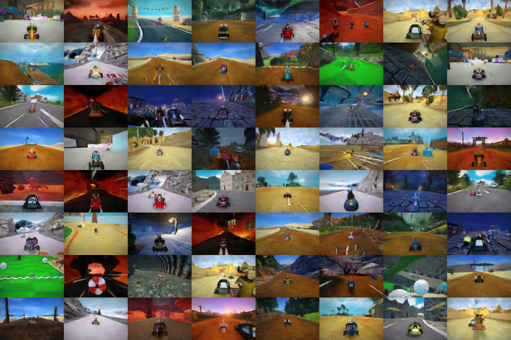

# Deep Learning Portfolio

A written tour of my graduate deep learning work, covering model compression,
autoregressive image generation, LLM fine-tuning, semantic segmentation, and
autonomous driving planners.

**Author:** Rahul Cheruku · MSAI

> ### Looking for code?
>
> The five projects written up below are graded assignments with course
> autograders, so their solution files stay private rather than becoming a search
> result for future students. What is here is the part worth reading: the
> architectures, the numbers, and what broke.
>
> **For complete, runnable code I wrote, see these public repositories:**
>
> | Repository | Code |
> | --- | --- |
> | [icu-mortality-xai](https://github.com/Rahul10d7/icu-mortality-xai) | Full SHAP and LIME analysis notebook, LaTeX report source, figure pipeline |
> | [sepsis-sql-analytics](https://github.com/Rahul10d7/sepsis-sql-analytics) | Ten BigQuery SQL analyses, from cohort building to window functions |
> | [clinical-notes-nlp](https://github.com/Rahul10d7/clinical-notes-nlp) | scispaCy and medspaCy NER pipeline, Word2Vec, ClinicalBERT embeddings |
> | [icu-risk-ml-dl](https://github.com/Rahul10d7/icu-risk-ml-dl) | Gradient boosting, PCA and k-means, and a bidirectional LSTM |
> | [llm-clinical-prompting](https://github.com/Rahul10d7/llm-clinical-prompting) | Prompting strategies and a TF-IDF baseline, on synthetic data |
> | [mimic-visual-explorer](https://github.com/Rahul10d7/mimic-visual-explorer) | Six visualizations plus an interactive Plotly explorer |
> | [icu-mortality-tutorial](https://github.com/Rahul10d7/icu-mortality-tutorial) | A teaching notebook with a synthetic demo mode, runs with no credentials |
> | [market-volatility-ml](https://github.com/Rahul10d7/market-volatility-ml) | End-to-end volatility forecasting pipeline |
>
> Those are open-ended projects rather than autograded problem sets, so the code
> is mine to publish. Happy to walk through any of the private implementations
> directly on request.

---

## Contents

1. [Compressing a network by 9x](#1-compressing-a-network-by-9x)
2. [Autoregressive image generation from scratch](#2-autoregressive-image-generation-from-scratch)
3. [Teaching a small LLM to reason](#3-teaching-a-small-llm-to-reason)
4. [Road segmentation with depth](#4-road-segmentation-with-depth)
5. [Three ways to plan a trajectory](#5-three-ways-to-plan-a-trajectory)
6. [What I took away from all of it](#what-i-took-away-from-all-of-it)

---

## 1. Compressing a network by 9x

**Task.** Take a 72.11 MB residual network with 18.9M parameters and make it
small enough to train and serve under tight memory limits, without losing
accuracy.

| Variant | Memory | Trainable params | Max output deviation |
| --- | --- | --- | --- |
| Baseline (float32) | 72.11 MB | 18.90 M | — |
| Half precision | 36.07 MB | 0.01 M | 0.0013 |
| LoRA (rank 32) | 40.57 MB | 1.19 M | 0.0014 |
| 4-bit block quantization | 11.36 MB | 0.03 M | 0.1844 |
| QLoRA | 15.86 MB | 1.19 M | 0.1993 |
| **3-bit block quantization** | **7.98 MB** | 0.03 M | 0.4050 |

**How it works.** Weights are quantized in small groups rather than per-tensor,
with each group storing its own float16 scale factor. Group size 16 for 4-bit,
64 for 3-bit. Quantization happens in a `_load_state_dict_pre_hook`, so a
checkpoint is compressed as it loads and the full-precision tensor never needs to
exist in memory. Layer normalization stays in float32 throughout, since it is
cheap and highly sensitive to precision loss.

The 3-bit variant was the interesting one. Three bits do not divide evenly into a
byte, so I packed eight 3-bit values into three bytes with vectorized bit shifts
and used asymmetric quantization (storing both a scale and a zero point) because
the weight distributions were not centred on zero.

**LoRA and QLoRA.** Instead of updating 18.9M weights, the base stays frozen and
two low-rank matrices per layer carry the adaptation. `lora_a` gets Kaiming
initialization and `lora_b` starts at zero, which means the adapter contributes
exactly nothing on the first forward pass and training begins from the base
model's behaviour rather than from noise. 1.19M trainable parameters, 6% of the
original, reached 100% accuracy on the downstream classifier.

**The honest caveat.** Deviation grows quickly at the low end: 0.0013 at float16,
0.18 at 4-bit, 0.41 at 3-bit. The 3-bit model passed its accuracy threshold, but
that margin is thin, and I would not deploy it without task-specific evaluation.
Compression ratios quoted without an error budget are not meaningful.

*Graded 105/100, including full extra credit for the sub-4-bit implementation.*

---

## 2. Autoregressive image generation from scratch

**Task.** Build a complete generative image pipeline without pretrained
components: compress images to discrete tokens, learn their distribution, and
sample new images.

  
  
  

<i>Samples from the trained autoregressive model, decoded through the BSQ tokenizer.</i>

**The three stages.**

**Patch autoencoder.** A convolutional encoder compresses non-overlapping 5x5
patches into a 128-dimensional latent, with residual blocks on both sides.
Validation MSE at or below 0.010.

**Binary spherical quantization.** This is the piece that makes the rest
possible. The continuous latent is projected down, L2-normalized onto the unit
sphere, and each dimension is binarized by its sign. Ten bits gives a
1024-entry codebook. Because the codebook is implicitly the vertices of a
hypercube on the sphere, there is no learned embedding table and therefore none
of the codebook collapse that plagues standard VQ-VAE training. The gradient
passes through the sign function with a straight-through estimator. Validation
MSE at or below 0.005, better than the continuous autoencoder it replaced.

**Causal transformer.** A 4-layer transformer (d_model 128, 4 heads) models the
600-token sequence per image with a causal mask, a learned positional embedding,
and a start token. Trained with cross-entropy, reported in bits per image.

**Extra credit: real compression.** I used the trained model as the probability
model for arithmetic coding, converting its per-token predictive distribution
into integer frequencies and encoding against them. **19.5x compression** at
0.0033 reconstruction MSE, against a 14x threshold for full marks. This was the
most satisfying part, because it turns a generative model into a working codec
where a better model directly produces a smaller file.

  

**What positional embeddings do.** Comparing samples with and without them makes
the contribution obvious:

  
  
  

<i>Left: with positional embeddings, coherent global layout. Right: without, locally plausible texture and no spatial structure.</i>

Without position information the model still produces believable local texture,
because neighbouring patches correlate strongly, but it has no way to know that
sky belongs at the top. The failure is specifically a failure of global
composition.

*Graded 105/105.*

---

## 3. Teaching a small LLM to reason

**Task.** Get a 360M parameter SmolLM2 to perform multi-step unit conversion
accurately. The constraint that made this interesting was that the model was
fixed, so every gain had to come from prompting or training rather than scale.

| Stage | Method | Accuracy |
| --- | --- | --- |
| Baseline | Direct prompting | near zero |
| Chain-of-thought | Two-shot ChatML prompt | 54% |
| Supervised fine-tuning | LoRA r=8, 4 epochs | 61% |
| **Rejection fine-tuning** | **LoRA r=16 on self-generated data** | **83%** |

**The progression.** Chain-of-thought prompting alone got to 54% with no
training, purely by formatting two worked examples inside the chat template.
Supervised fine-tuning on ground-truth answers added 7 points, which was less
than I expected: the model learned the output format well but not the
intermediate reasoning, because the training targets contained only final
answers.

Rejection fine-tuning is what actually worked, and the idea is elegant. Sample
the model ten times per question at temperature 0.6, keep only the rollouts that
reach the correct answer, and fine-tune on those. The training signal is now the
model's own successful reasoning traces rather than bare answers, so it learns a
process it is already capable of executing instead of imitating a format. That
jumped accuracy 22 points to 83%.

**Debugging notes, because these cost me the most time.**

- **The model generated empty strings and scored zero.** SmolLM2-Instruct sets
  `eos_token_id` to `<|im_end|>`, a dialogue delimiter. Given a raw prompt with no
  chat envelope, the model emitted that token immediately and stopped with zero
  output tokens. Switching to `<|endoftext|>` for untemplated prompts fixed it.
  Worth internalizing: instruction-tuned models have two distinct notions of
  "stop," and confusing them looks like total model failure rather than a config bug.
- **`target_modules="all-linear"` crashed PEFT.** SmolLM2 ties `lm_head` and
  `embed_tokens` weights, and LoRA cannot attach to tied embeddings. Listing the
  seven projection modules explicitly resolved it.
- **Sequential generation hit the evaluation timeout** at 48s against a 40s limit,
  scoring zero despite correct output. Capping unbatched generation at 20 new
  tokens brought it under 18s while staying well inside the loss threshold. A
  correct model that does not finish in time is worth the same as a broken one.
- **Learning rate 1e-3 collapsed the model** into emitting only EOS tokens.
  5e-4 trained cleanly. LoRA is more learning-rate sensitive than its parameter
  count suggests.

*Graded 105/100.*

---

## 4. Road segmentation with depth

**Task.** Classify driving scenes, then densely predict road geometry and depth
from a single image.

| Metric | Result | Threshold |
| --- | --- | --- |
| Classification accuracy | **0.911** | 0.80 |
| Segmentation mIoU | **0.794** | 0.75 |
| Depth MAE | **0.003** | 0.05 |

**Architecture.** A U-Net style encoder-decoder with skip connections and two
output heads sharing one backbone: a 3-class segmentation head trained with
cross-entropy, and a depth regression head with a sigmoid output trained with L1
loss. The shared trunk is the point. Segmentation and depth are complementary
views of the same 3D structure, so features useful for one help the other, and
one backbone is far cheaper than two networks.

The classifier that preceded it used three convolutional blocks with batch
normalization and dropout, and reached 0.911 largely thanks to augmentation:
color jitter, horizontal flips, rotation, and random resized crops. On a dataset
of rendered game frames the raw images are almost too clean, and augmentation was
what closed the gap between training and validation performance.

Depth MAE of 0.003 sits far below the 0.05 threshold, which says more about the
determinism of rendered depth maps than about the model. I would not expect that
number to survive contact with real camera data.

*Graded 96/100.*

---

## 5. Three ways to plan a trajectory

**Task.** Predict the next three waypoints for a vehicle, using three
deliberately different input representations.

| Planner | Input | Longitudinal error | Lateral error | Verdict |
| --- | --- | --- | --- | --- |
| MLP | Lane boundary points | 0.151 | 0.517 | Passed |
| Transformer | Lane boundary points | 0.157 | **0.882** | **Failed lateral** |
| CNN | Raw pixels | 0.172 | **0.291** | Best lateral |

**The result I did not expect.** The CNN planning directly from pixels beat both
planners that received clean, structured lane geometry, and it beat them on
lateral error by a wide margin. Working from raw images should be the harder
problem. My reading is that the lane-point representation discards context the
CNN retains: road texture, vanishing point, and scene layout all inform where the
lane is actually heading, and ten boundary coordinates do not capture that.

**The transformer underperformed and I know why.** A Perceiver-style
encoder-decoder with learned waypoint queries cross-attending to encoded lane
points, at d_model 64 with 4 heads and 2 layers, it hit 0.882 lateral error
against a 0.6 threshold. The likely cause is capacity and data scale rather than
the architecture being wrong for the task: attention over a 20-token input has
very little structure to exploit, and transformers of this size are
data-hungry relative to an MLP with a comparable parameter budget. Given more
time I would test whether stronger positional encoding of the lane points or
simply a larger d_model closes the gap, since right now I can explain the
failure but have not proven the cause.

Reporting this one at 70/100 rather than quietly leaving it out, because the
comparison is the useful part.

*Graded 70/100.*

---

## What I took away from all of it

**The metric is not the finding.** Twice the most valuable result came from
distrusting a good number: SHAP revealing that my ICU mortality model was leaning
on a feature that leaked the outcome, and a 0.003 depth MAE that reflects
rendered data rather than genuine skill. Both looked like success.

**Constraints produce better engineering than scale does.** A 40 MB submission
cap forced me to cast adapters to float16 and strip event logs. A 40s evaluation
timeout forced me to understand the real cost of sequential decoding. The 3-bit
quantizer only exists because 4-bit was not small enough. None of that would have
happened with unlimited resources.

**Most of my debugging time went to interfaces, not mathematics.** Tied
embeddings breaking PEFT, `<|im_end|>` versus `<|endoftext|>`, `pathlib.Path`
failing a HuggingFace validator that wanted a string. The models were mostly
fine. The plumbing between them was not.

**Simple baselines deserve real effort.** Linear regression beat gradient
boosting on volatility. A CNN beat a transformer on planning. An MLP beat that
same transformer. I now fit the simple thing properly before assuming the
sophisticated one will win.

---

## Related repositories

See the [code table at the top](#looking-for-code) for eight public repositories
with complete, runnable implementations.

The five projects written up on this page keep their source private because they
are graded assignments with autograders. My healthcare work is public, but with
one constraint applied throughout: no MIMIC-III data is redistributed and saved
outputs carrying patient identifiers or clinical note text have been stripped, as
required by the PhysioNet Credentialed Health Data Use Agreement. The code and
aggregate results are all there.
